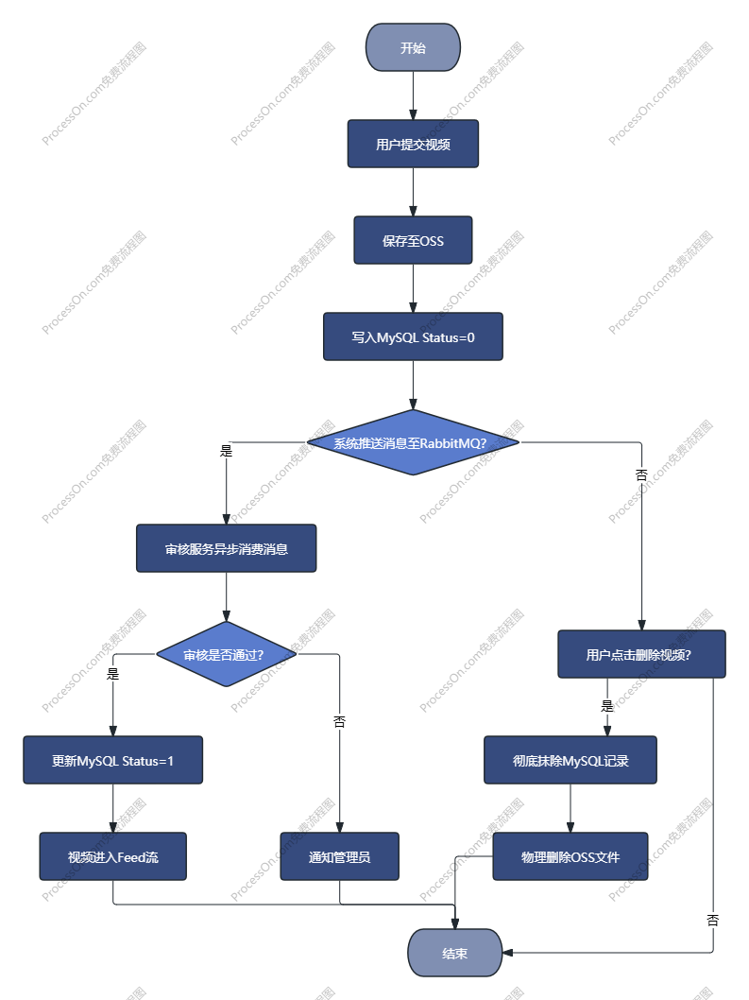

# g-video项目概览与需求文档

## 一、项目概述

本项目是一个仿“抖音”的短视频后端服务。采用 **Go 语言微服务架构**，解决海量视频上传、高效流媒体分发、分布式鉴权及内容安全过滤等核心技术挑战。

## 二、技术栈

**语言：** Go 

**框架：** Gin / Hertz (Web层), gRPC (服务间调用)

**数据库：** MySQL (持久化), GORM (ORM)

**缓存：** Redis (Feed流缓存、计数器)

**对象存储：** 阿里云 OSS 

**基础设施：** Docker (容器化), Nginx (负载均衡)

**中间件：** RabbitMQ 

**架构拆分：** 采用 **BFF (Backend For Frontend)** 模式，`web-server` 负责路由转发、JWT 鉴权与参数校验；`logic-server` 负责核心业务逻辑（数据库操作、OSS 交互、RabbitMQ 消息发送），两者通过 **gRPC** 进行高性能通信。

## 三、核心功能

### 1、视频模块

**视频发布：** 支持大文件分片上传，对接云端存储（OSS/MinIO）。

**Feed 流推送：** 首页视频流按时间倒序推荐，采用 Redis 缓存优化。

**内容撤回：** **支持用户本人物理删除视频**。

- **操作：** 数据库记录永久移除 + 同步调用 **OSS API** 删除云端存储文件，确保空间不浪费。

### 2、审核管理

**人工审核流：** 视频上传后进入“待审核”状态，需管理员后台介入。

**异步审核流：** 引入 **RabbitMQ** 实现上传与审核解耦。视频上传成功后，系统即刻向 `video.audit` 交换机发送消息，不阻塞用户上传主流程。

**管理员决策：**

* `通过`：视频进入 Feed 流，全网可见。

- `拒绝`：视频直接从数据库和 OSS 中抹除。

### 3、用户与社交

**分布式鉴权：** 基于 JWT 的登录注册体系。

**互动系统：** 支持点赞、评论及粉丝关注功能。

## 四、核心流程图

