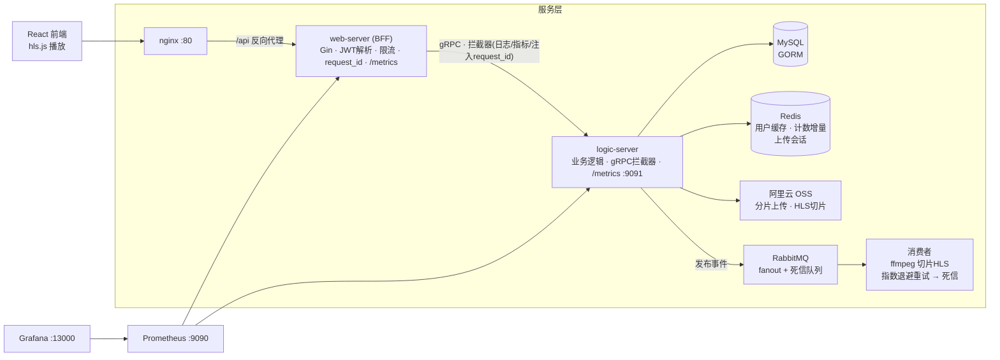

# g-video 短视频系统

[](https://github.com/Lhh220/g-video/actions/workflows/ci.yml)
[](./LICENSE)

仿抖音的短视频后端服务：Go 微服务架构，覆盖大文件上传、流媒体分发、异步审核、高并发互动等技术场景。

## 架构


```mermaid
flowchart LR
    B[React 前端<br/>hls.js 播放] --> NG[nginx :80]

    subgraph 服务层
        NG -->|"/api 反向代理"| W["web-server (BFF)<br/>Gin · JWT解析 · 限流 · request_id · /metrics"]
        W -->|"gRPC · 拦截器(日志/指标/注入request_id)"| L["logic-server<br/>业务逻辑 · gRPC拦截器 · /metrics :9091"]
        L --> M[(MySQL<br/>GORM)]
        L --> R[(Redis<br/>用户缓存 · 计数增量<br/>上传会话)]
        L --> O[阿里云 OSS<br/>分片上传 · HLS切片]
        L -->|"发布事件"| Q["RabbitMQ<br/>fanout + 死信队列"]
        Q --> C["消费者<br/>ffmpeg 切片HLS<br/>指数退避重试 → 死信"]
    end

    P[Prometheus :9090] --> W
    P --> L
    G[Grafana :13000] --> P
```

- **BFF 拆分**：`web-server`（Gin，鉴权/校验/限流/协议转换）与 `logic-server`（gRPC，数据库/OSS/MQ 交互）独立扩缩容
- **全链路可观测**：zap 结构化日志 + request_id 跨服务贯穿 + Prometheus/Grafana 监控
- **一键部署**：`docker compose up -d --build` 拉起全部 8 个容器（含 MySQL/Redis/RabbitMQ/Prometheus/Grafana）

## 技术栈

| 层 | 选型 |
|----|------|
| 语言/框架 | Go 1.25 · Gin · gRPC + protobuf |
| 存储 | MySQL 8 (GORM) · Redis · 阿里云 OSS |
| 消息队列 | RabbitMQ (fanout + 死信队列) |
| 流媒体 | ffmpeg 切片 HLS · hls.js 播放 · OSS 截帧封面 |
| 可观测 | zap · Prometheus · Grafana |
| 部署 | Docker Compose (healthcheck 编排) · GitHub Actions CI |
| 前端 | React 18 · axios · spark-md5 |

## 核心功能

### 视频模块
- **大文件上传三件套**：5MB 分片上传 + 断点续传（Redis 会话 + OSS ListParts 恢复进度）+ MD5 秒传（同指纹文件零传输复用云端对象）
- **HLS 流媒体**：发布事件进 MQ，消费者 ffmpeg 切片（10s/片，remux 不重编码）上传 OSS，前端优先 m3u8 播放、无切片回退 mp4
- **Feed 流**：时间倒序游标分页；用户信息/关注/点赞状态 Redis 预取，`(status, created_at)` 复合索引

### 审核管理
- 视频上传默认待审，管理员后台页面预览视频并**通过/驳回（带原因）**
- 驳回即物理删除：数据库记录 + 点赞评论 + OSS 文件 + HLS 切片目录
- MQ 异步链路：指数退避重试（200ms→1s→3s）→ 死信队列留档，MQ 不可用自动降级

### 用户与社交
- JWT 鉴权（密钥外置配置）；管理员账号启动时自动引导创建，注册接口不可指定角色
- 点赞/评论/关注；**点赞计数 Redis 写合并**：增量进 Redis、每 5s 批量落库，读路径合并未落库增量

## 快速开始

```bash
# 1. 准备配置 (填入真实 OSS 密钥)
cp logic-server/configs/config.yaml.example logic-server/configs/config.yaml

# 2. 一键起全套 (8 容器)
docker compose up -d --build

# 内存紧张的机器可逐个构建
docker compose build logic-srv && docker compose build web-srv && docker compose build frontend
docker compose up -d
```

| 入口 | 地址 | 说明 |
|------|------|------|
| 前端 | http://localhost | 注册/登录/刷视频/审核后台 |
| Grafana | http://localhost:13000 | admin/admin，Dashboard 已自动加载 |
| Prometheus | http://localhost:9090 | 指标查询 |
| RabbitMQ 控制台 | http://localhost:15674 | guest/guest |
| MySQL | localhost:3307 | root/123456，库 g_video |
| 后端 API | http://localhost:8081 | 供前端 nginx 内网代理 |

## 性能压测

压测环境：Windows 本机 Docker 栈，MySQL 5300 条视频、251 用户、50 关注关系。工具：`tools/bench`。

| 接口 | 优化前 QPS | 优化前 P99 | 优化后 QPS | 优化后 P99 |
|------|-----------|-----------|-----------|-----------|
| GET /video/follow/feed（关注流，300条） | 8.6 | 762ms | **474** | **77ms** |
| GET /video/feed（首页流，30条） | 631 | 167ms | **949** | **98ms** |
| POST /favorite/action（点赞） | — | — | 1386 | 35ms |

关键优化：

1. **关注流 N+1 消除**（QPS ×55，P99 -90%）：循环内每视频 2 条 SQL（作者+点赞计数）改为两次 `IN` 批量预取 + Map 组装
2. **Feed 复合索引**（QPS +50%）：`(status, created_at)` 消除全表 filesort
3. **点赞计数写合并**：Redis 增量 + 定时落库，单次点赞仅 1 次关系行写入

复现：

```bash
python tools/seed/gen_seed.py <bcrypt哈希> > seed.sql   # 造数 (哈希: go run ./tools/seed/pwdhash 密码)
go run ./tools/token 100000 [secret]                   # 压测用户 JWT
go run ./tools/bench -url http://localhost:8081/api/v1/video/feed -c 50 -d 15s
```

## 接口概览

统一前缀 `/api/v1`，完整文档见 [docs/api文档.md](docs/api文档.md)：用户（注册/登录/信息/更新）、视频（Feed/关注流/作品列表/删除/分片上传三步协议）、社交（点赞/评论/关注）、管理（审核/待审列表）。

## 项目结构

```
api/proto/            gRPC 服务定义 (user/video/social)
web-server/           BFF 层：Gin 路由、JWT、限流、request_id
logic-server/
  internal/service/   业务逻辑 (用户/视频/社交/分片上传/计数落库)
  internal/mq/        RabbitMQ 生产者/消费者/死信/HLS转码
  internal/interceptors/  gRPC 拦截器 (recovery/日志/指标)
  pkg/                database/oss/redis/logx/utils 基础设施
g-video-web/          React 前端
deployments/          Prometheus/Grafana 配置
tools/                bench 压测 / seed 造数 / token 签发
docs/                 API 文档、数据库设计
```
