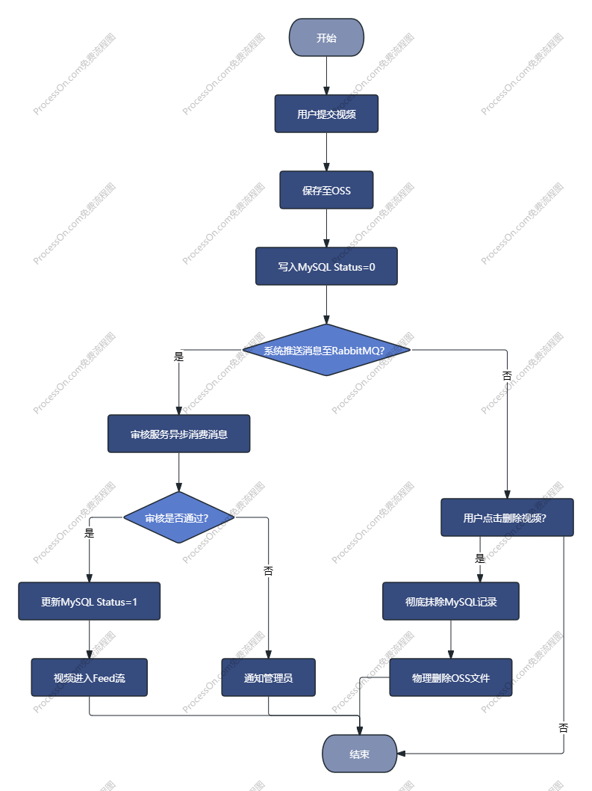

# g-video项目概览与需求文档

## 一、项目概述

本项目是一个仿“抖音”的短视频后端服务。采用 **Go 语言微服务架构**，解决海量视频上传、高效流媒体分发、分布式鉴权及内容安全过滤等核心技术挑战。

## 二、技术栈

**语言：** Go 

**框架：** Gin / Hertz (Web层), gRPC (服务间调用)

**数据库：** MySQL (持久化), GORM (ORM)

**缓存：** Redis (Feed流缓存、计数器)

**对象存储：** 阿里云 OSS 

**基础设施：** Docker (容器化), Nginx (负载均衡)

**中间件：** RabbitMQ 

**架构拆分：** 采用 **BFF (Backend For Frontend)** 模式，`web-server` 负责路由转发、JWT 鉴权与参数校验；`logic-server` 负责核心业务逻辑（数据库操作、OSS 交互、RabbitMQ 消息发送），两者通过 **gRPC** 进行高性能通信。

## 三、核心功能

### 1、视频模块

**视频发布：** 大文件分片上传 (5MB/片) + 断点续传 (Redis 会话 + OSS ListParts) + MD5 秒传去重，直传 OSS。

**流媒体分发：** 发布事件经 RabbitMQ 异步消费，ffmpeg 切片为 HLS (m3u8 + ts) 上传 OSS；前端 hls.js 播放，无切片自动回退 mp4 直链。

**Feed 流推送：** 首页视频流按时间倒序，用户信息/关注状态/点赞状态全部走 Redis 预取，循环内零 SQL。

**内容撤回：** **支持用户本人物理删除视频**。

- **操作：** 数据库记录永久移除 + 同步调用 **OSS API** 删除云端文件与 HLS 切片，确保空间不浪费。

### 2、审核管理

**人工审核流：** 视频上传后进入“待审核”状态，管理员在后台页面预览视频并决策 (通过/驳回+原因)。

**异步审核流：** 引入 **RabbitMQ** 实现上传与后续处理解耦。视频上传成功后，系统即刻向 `video_publish` 交换机发送消息，不阻塞用户上传主流程 (MQ 不可用时自动降级)。

**管理员决策：**

* `通过`：视频进入 Feed 流，全网可见。

- `拒绝`：视频连同点赞评论从数据库物理抹除，OSS 文件同步删除。

### 3、用户与社交

**分布式鉴权：** 基于 JWT 的登录注册体系，角色由服务端签发，管理员账号启动时自动引导创建。

**互动系统：** 支持点赞、评论及粉丝关注。点赞计数走 **Redis 增量 + 定时批量落库** (写合并削峰)，读路径合并未落库增量保证读己之写。

## 四、核心流程图


## 七、性能压测

压测环境：Windows 本机 Docker 栈（web/logic 限单容器），MySQL 5300 条视频、251 用户、50 关注关系。
工具：仓库自带 `tools/bench`（Go 编写，支持并发/时长/分位延迟）。

| 接口 | 优化前 QPS | 优化前 P99 | 优化后 QPS | 优化后 P99 |
|------|-----------|-----------|-----------|-----------|
| GET /video/follow/feed（关注流，返回300条） | 8.6 | 762ms | **474** | **77ms** |
| GET /video/feed（首页流，返回30条） | 631 | 167ms | **949** | **98ms** |
| POST /favorite/action（点赞） | — | — | 1386 | 35ms |

关键优化：

1. **关注流 N+1 消除**（QPS ×55，P99 -90%）：原实现循环内每个视频查一次作者+一次点赞计数，
   300 条视频 = 600 次数据库往返；改为两次 `IN` 批量预取 + 内存 Map 组装，循环内零 SQL。
2. **Feed 复合索引**（QPS +50%）：`(status, created_at)` 复合索引覆盖"状态过滤+时间倒序"查询，
   消除全表 filesort。
3. **点赞计数写合并**：Redis 增量 + 每 5 秒批量落库，单次点赞仅 1 次关系行写入。

复现方式：

```bash
python tools/seed/gen_seed.py <bcrypt哈希> > seed.sql     # 造数（哈希用 tools/seed/pwdhash 生成）
go run ./tools/token 100000                              # 生成压测用户 JWT
go run ./tools/bench -url http://localhost:8081/api/v1/video/feed -c 50 -d 15s
```
